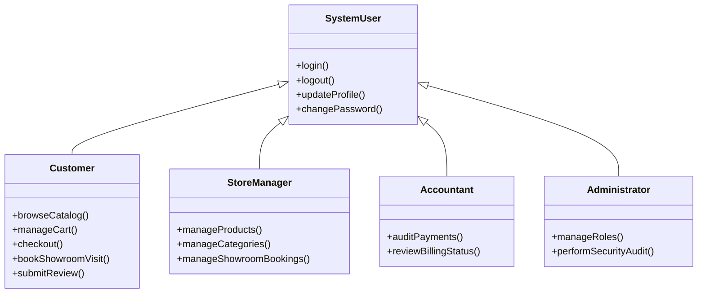
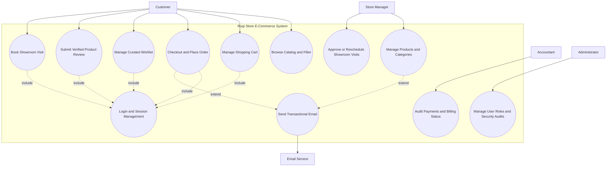

# 4. Use Case Model

## 4.1 Actor Catalog

| Actor | Type | Description | Key Goals |
|-------|------|-------------|-----------|
| Customer | Primary | Registered customer purchasing furniture products online | Browse products, manage cart, place orders, book showroom visits, submit verified reviews |
| Store Manager | Primary | Employee responsible for store operations and product management | Manage products, categories, showroom appointments, inventory activities |
| Accountant | Primary | Staff member responsible for financial monitoring | Audit payments, billing status, invoices, and transaction records |
| Administrator | Primary | System administrator responsible for security and user management | Manage roles, permissions, security audits, and system access |
| Email Service | Secondary | External SMTP notification service | Deliver order confirmations, invoices, and transactional notifications |

---

## Actor Generalization

## 4.2 Use Case Diagram

## Relationships Explained

### Include Relationship (Login and Session Management)

The `include` relationship represents mandatory authentication behavior required before executing specific use cases.

The following use cases require an authenticated session:

- Manage Shopping Cart
- Checkout and Place Order
- Manage Curated Wishlist
- Submit Verified Product Review
- Book Showroom Visit

Authentication is reused as a common system behavior to ensure secure access to customer-specific data.

---

### Extend Relationship (Transactional Email)

The `extend` relationship represents optional additional behavior triggered after successful system operations.

Examples:

- Successful checkout triggers order confirmation and invoice email notifications.
- Product management events may trigger email notifications when configured conditions occur.

The Email Service is modeled as an external secondary actor responsible for delivering transactional messages.

---

# 4.3 Use Case Descriptions

## UC-004: Checkout and Place Order (Fully Dressed)

| Field | Detail |
|-------|--------|
| **Use Case ID** | UC-004 |
| **Name** | Checkout and Place Order |
| **Actor** | Customer |
| **Description** | A registered customer reviews their shopping cart, provides shipping information, and finalizes the purchase while the system locks prices, updates inventory, and creates an order record. |
| **Preconditions** | Customer is logged in; cart contains at least one active item; all products have sufficient stock availability. |
| **Postconditions** | Order is created; product prices are frozen; inventory quantities are reduced; cart is cleared; invoice is generated; confirmation email is queued. |
| **Trigger** | Customer clicks **"Proceed to Checkout."** |

---

### Main Success Scenario

| Step | Action |
|------|--------|
| 1 | Customer reviews cart contents and selects **"Proceed to Checkout."** |
| 2 | System requests shipping address and billing information. |
| 3 | Customer enters valid information and confirms the order. |
| 4 | System starts a database transaction. |
| 5 | System locks product records and validates stock availability. |
| 6 | System deducts purchased quantities from inventory. |
| 7 | System stores current product prices as `PriceSnapshot` values. |
| 8 | System removes purchased items from the shopping cart. |
| 9 | System commits the transaction and creates an invoice with **Pending Payment** status. |
| 10 | System displays confirmation details and sends an order notification email. |

---

### Alternative Flows

| ID | Condition | Steps |
|----|-----------|-------|
| A1 | Customer has no saved address | System requests a new address, validates it, saves it, and continues checkout. |
| A2 | Customer modifies the cart before payment | System recalculates totals and validates stock again before continuing. |

---

### Exception Flows

| ID | Condition | Steps |
|----|-----------|-------|
| E1 | Insufficient Stock | Transaction is rolled back and the customer receives a stock availability warning. |
| E2 | Payment Gateway Failure | Order process is cancelled and the customer receives a payment failure message. |
| E3 | Database Transaction Failure | System rolls back all changes and records the failure event. |

---

### Business Rules

- Product prices must be frozen during checkout.
- Historical orders must not change after catalog price updates.
- Checkout must execute inside a database transaction to prevent overselling.
- Inventory quantities cannot become negative.

---
## UC-007: Book Showroom Visit (Fully Dressed)

| Field | Detail |
|-------|--------|
| **Use Case ID** | UC-007 |
| **Name** | Book Showroom Visit |
| **Actor** | Customer |
| **Description** | Customer schedules a showroom appointment to physically view furniture products and select a suitable visit time. |
| **Preconditions** | Customer is authenticated; the selected showroom location exists; the requested time slot is available; booking is within business hours. |
| **Postconditions** | Appointment record is created; booking status becomes **Pending Approval**; the store manager receives a notification. |
| **Trigger** | Customer selects **"Book Showroom Visit."** |

---

### Main Success Scenario

| Step | Action |
|------|--------|
| 1 | Customer selects a showroom location. |
| 2 | System displays available dates and time slots. |
| 3 | Customer chooses a preferred slot and confirms the booking. |
| 4 | System validates slot availability. |
| 5 | System creates an appointment record in the database. |
| 6 | System assigns **Pending Approval** status. |
| 7 | System displays the booking confirmation details. |
| 8 | System notifies the store manager about the new appointment request. |

---

### Alternative Flows

| ID | Condition | Steps |
|----|-----------|-------|
| A1 | Customer edits the booking | Customer selects another available slot and updates the appointment details. |
| A2 | Customer cancels the booking | System updates the appointment status to **Cancelled** and releases the time slot. |

---

### Exception Flows

| ID | Condition | Steps |
|----|-----------|-------|
| E1 | Double booking detected | System rejects the request and asks the customer to select another available slot. |
| E2 | Showroom unavailable | System informs the customer that the selected showroom cannot accept bookings currently. |

---

### Business Rules

- A customer cannot have multiple active bookings for the same showroom slot.
- Appointments require manager approval before final confirmation.
- Booking must occur only within configured business hours.

---

## UC-006: Submit Verified Product Review (Brief)

| Field | Detail |
|-------|--------|
| **Use Case ID** | UC-006 |
| **Name** | Submit Verified Product Review |
| **Actor** | Customer |
| **Description** | Customer submits a rating and review only for products they have purchased and received. |
| **Preconditions** | Customer is logged in; the product exists in a delivered order; the customer has not reviewed the product before. |
| **Postconditions** | Review record is stored; review status becomes **Pending Moderation**. |
| **Trigger** | Customer opens a purchased product page and selects **"Write Review."** |

---

### Main Flow

| Step | Action |
|------|--------|
| 1 | Customer opens the product details page. |
| 2 | System verifies the customer's purchase history. |
| 3 | Customer enters a rating from **1 to 5 stars** and writes the review text. |
| 4 | System checks for duplicate reviews. |
| 5 | Customer submits the review. |
| 6 | System saves the review with **Pending Moderation** status for administrator approval. |

---

### Validation Rules

- Customer must be authenticated.
- Product must exist in a **Delivered** order.
- Each customer can submit only one review per product.
- Reviews require moderation before public display.

---

[← Previous: Requirements Specification](./03-requirements.md) | [Back to Index](./00-index.md) | [Next: User Stories →](./05-user-stories.md)
