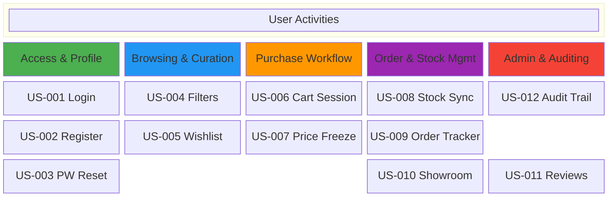

# 05. User Stories & Backlog

## 5.1 Epic Overview

| Epic | Description | Story Count |
| :--- | :--- | :---: |
| **E1: Identity & Access Management** | Registration, secure login, role enforcement, profile updates. | 3 |
| **E2: Interactive Catalog & Curation** | Browsing, advanced filtering, wishlist management. | 3 |
| **E3: Shopping Cart & Checkout** | Persistent cart, transactional checkout, price freezing. | 3 |
| **E4: Order & Inventory Management** | Pipeline tracking, stock updates, low-stock warnings. | 3 |
| **E5: Experience & Appointment Scheduling**| Showroom calendar, verified buyer reviews. | 2 |
| **E6: Platform Administration** | Role modification, audit logs, review moderation. | 2 |

---

## 5.2 User Stories with Acceptance Criteria

### Epic 1: Identity & Access Management

**US-001: Secure Login**
> As a **registered user**, I want to **log in with my email and password** so that I can **access personalized features and dashboard views**.

Acceptance Criteria:
* **Given** valid credentials, **when** I click Login, **then** the system redirects me to my role-specific dashboard.
* **Given** invalid credentials, **when** I click Login, **then** I see "Invalid email or password" and remain on the login page.
* **Given** 5 consecutive failed attempts, **when** I try to log in again, **then** my account is locked for 15 minutes to prevent brute-force attacks.

Story Points: 3 | Priority: Must

---

**US-002: Customer Registration**
> As a **guest visitor**, I want to **register a new account** so that I can **save items to my cart and wishlist permanently**.

Acceptance Criteria:
* **Given** I fill in required registration fields (Unique Email, Password, Name), **when** I submit the form, **then** my account is created and my default role is set to `Customer`.
* **Given** an email address that is already registered, **when** I submit the form, **then** the system displays a validation error and prevents duplicate registration.

Story Points: 3 | Priority: Must

---

**US-003: Password Reset**
> As a **registered user**, I want to **request a password reset via my email** so that I can **regain access to my account if I forget my credentials**.

Acceptance Criteria:
* **Given** I enter my registered email, **when** I click Reset, **then** I receive an email containing a secure link valid for exactly 1 hour.
* **Given** I click an expired reset link, **when** the reset page loads, **then** I see "This link has expired. Please request a new one."

Story Points: 2 | Priority: Must

---

### Epic 2: Interactive Catalog & Curation

**US-004: Advanced Catalog Filtering**
> As a **customer**, I want to **filter furniture items by price, material, and availability** so that I can **find pieces that fit my budget and room design**.

Acceptance Criteria:
* **Given** I select a specific material (e.g., "Oak Wood") and price range, **when** the catalog updates, **then** only products matching both criteria are displayed.
* **Given** a search query, **when** results render, **then** the system prioritizes exact SKU or title matches.

Story Points: 3 | Priority: Should

---

**US-005: Curated Wishlist Management**
> As a **customer**, I want to **save items to a personal wishlist** so that I can **keep track of furniture pieces I like without buying them immediately**.

Acceptance Criteria:
* **Given** I am logged in, **when** I click "Add to Wishlist" on a product page, **then** the item is persistently saved to my "Curated Collection".
* **Given** my wishlist, **when** I click "Move to Cart" on a wishlist item, **then** the item is added to my active shopping cart and removed from the wishlist.

Story Points: 3 | Priority: Should

---

### Epic 3: Shopping Cart & Checkout

**US-006: Persistent Shopping Cart**
> As a **customer**, I want my **shopping cart to persist across different login sessions** so that I can **continue my shopping experience on any device**.

Acceptance Criteria:
* **Given** I add items to my cart, **when** I log out and log back in on another device, **then** my cart items and their quantities remain intact.
* **Given** an item's stock is reduced to 0 by another checkout, **when** I view my cart, **then** the system flags the item as "Out of Stock" and disables checkout until it is removed.

Story Points: 5 | Priority: Must

---

**US-007: Transactional Checkout & Price Freezing**
> As a **customer**, I want to **complete my checkout securely** so that my **order is locked in and stock is safely reserved**.

Acceptance Criteria:
* **Given** I click "Place Order", **when** the transaction executes, **then** the system captures the current catalog price as an immutable snapshot in `OrderItem`.
* **Given** a successful transaction, **when** the checkout finishes, **then** the system empties my active shopping cart and sets the order status to `Pending Payment`.

Story Points: 8 | Priority: Must

---

### Epic 4: Order & Inventory Management

**US-008: Real-Time Stock Deduction**
> As a **store manager**, I want the **system to deduct inventory immediately after an order is placed** so that we **never oversell furniture items**.

Acceptance Criteria:
* **Given** a concurrent checkout attempt for the last available item, **when** the transaction locks the row, **then** only the first request succeeds and the second is safely rejected with an out-of-stock warning.
* **Given** stock drops below a configurable low-stock threshold, **when** the deduction commits, **then** the system dispatches an automated warning notification to the manager dashboard.

Story Points: 5 | Priority: Must

---

**US-009: Order Pipeline Tracking**
> As a **customer**, I want to **track my order's progress through different stages** so that I **know when to expect delivery**.

Acceptance Criteria:
* **Given** an active order, **when** the backend updates its status (e.g., from `Processing` to `Shipped`), **then** I can view the updated state in real time on my profile page.

Story Points: 3 | Priority: Must

---

### Epic 5: Experience & Appointment Scheduling

**US-010: Interactive Showroom Booking**
> As a **customer**, I want to **schedule a showroom viewing online** so that I can **inspect premium furniture pieces in person**.

Acceptance Criteria:
* **Given** I open the showroom booking calendar, **when** I select an open date/time slot, **then** the slot is temporarily reserved until approved by a manager.
* **Given** a booking cancellation request, **when** the request is made less than 24 hours before the scheduled slot, **then** the system blocks the cancellation.

Story Points: 5 | Priority: Should

---

**US-011: Verified Buyer Reviews**
> As a **customer**, I want to **view and post reviews for products I have purchased** so that I can **share my experience with other shoppers**.

Acceptance Criteria:
* **Given** I have purchased a product and my order is marked as `Delivered`, **when** I submit a rating (1-5 stars) and feedback, **then** the review is saved.
* **Given** I have already submitted a review for a specific product, **when** I attempt to write another, **then** the system blocks the submission to maintain review integrity.

Story Points: 3 | Priority: Must

---

### Epic 6: Platform Administration

**US-012: Security Audit Trail**
> As an **administrator**, I want to **view immutable audit logs of privileged operations** so that I can **monitor changes and maintain accountability**.

Acceptance Criteria:
* **Given** an admin log entry, **when** viewed on the security dashboard, **then** it displays the Actor ID, timestamp, Action type, and IP address.
* **Given** the audit logs database, **when** any user (including admins) tries to edit or delete log entries, **then** the system rejects the operation to maintain immutability.

Story Points: 5 | Priority: Must

---

## 5.3 Story Map Summary

### Release Plan

* **Release 1 (Sprint 1–3):** Top row — Secure Login, Catalog Filters, Cart Session, Stock Synchronization, Audit Trail.
* **Release 2 (Sprint 4–6):** Middle row — Customer Registration, Wishlist, Price Snapshots, Order Pipeline Tracking.
* **Release 3 (Sprint 7–8):** Bottom row — Password Reset, Showroom Calendar, Verified Reviews.

---

[← Previous: Use Case Model](./04-use-case-model.md) | [Back to Index](./README.md) | [Next: Domain Model →](./06-domain-model.md)
