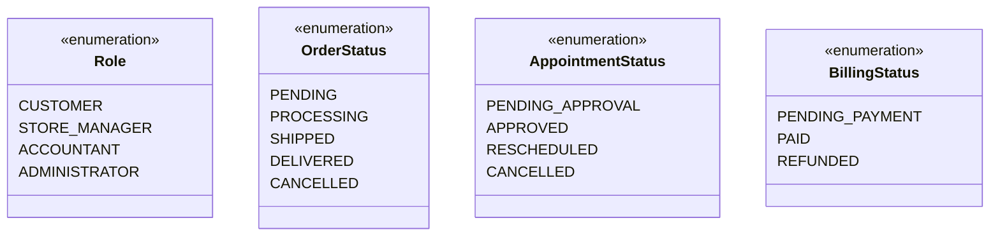

# 06. Domain Model & Class Diagram

## 6.1 Identifying Classes from Use Cases

Domain classes are discovered by extracting nouns from use case descriptions, database structures, and e-commerce requirements. The key technique is to examine actors, objects mentioned in purchasing/booking scenarios, and persistent data.

| Source | Nouns Extracted | Candidate Class |
| :--- | :--- | :--- |
| **UC-004: Checkout & Place Order** | customer, shopping cart, product, order, order item, price snapshot, inventory stock | Customer, Cart, CartItem, Product, Order, OrderItem |
| **UC-007: Book Showroom Visit** | customer, showroom, appointment, booking date, time slot, status | ShowroomAppointment |
| **UC-006: Submit Product Review** | customer, product, review rating, comments, verified status | ProductReview |
| **FR-002: Role-Based Access Control** | user, identity, role, email, password | ApplicationUser, Role |
| **FR-006: Dynamic Catalog** | category, product catalog, search filters | Category |

After filtering out attributes, transient request states, and out-of-scope system nouns, the final structural domain classes are defined below.

---

## 6.2 Domain Model

## 6.3 Class Relationship Summary

| Relationship | Type | Description |
| :--- | :--- | :--- |
| **User → Customer / StoreManager** | Inheritance | All active roles inherit identity properties. Each child class extends the base `User` class with role-specific behavior. |
| **Category → Product** | Association (1:*) | A category contains many products. Every product belongs to exactly one category. |
| **Customer → Cart** | Composition (1:1) | A cart exists only for its owning customer and cannot exist independently. |
| **Cart → CartItem** | Composition (1:*) | Cart items are dependent child entities. Removing a cart removes all associated cart items. |
| **Order → OrderItem** | Composition (1:*) | Order items represent immutable purchase lines belonging exclusively to a single order. |
| **Product → OrderItem** | Association (1:*) | Each order item stores a `priceSnapshot` to preserve historical pricing. |
| **Customer → ShowroomAppointment** | Association (1:*) | A customer may schedule multiple showroom appointments. |
| **Customer → ProductReview** | Association (1:*) | A verified customer may submit one review per purchased product. |

---

## 6.4 Enumeration Types

---

[← Previous: User Stories](./05-user-stories.md) | [Back to Index](./README.md) | [Next: UML Behavioral Models →](./07-uml-behavioral.md)
