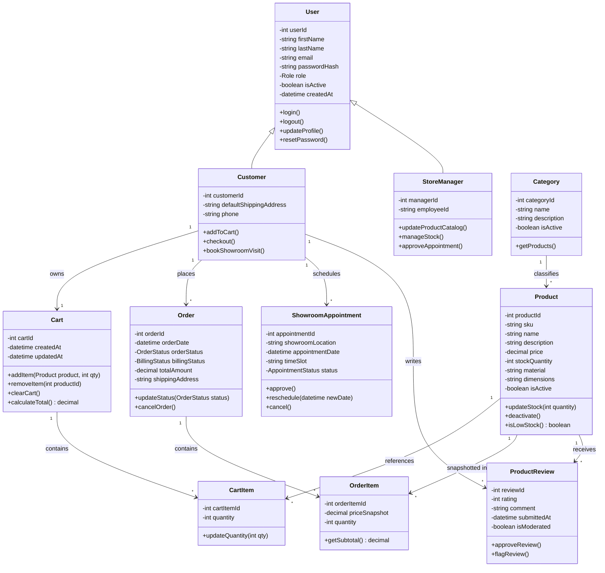

# 06. Domain Model & Class Diagram

## 6.1 Identifying Classes from Use Cases

Domain classes are discovered by extracting nouns from use case descriptions, database structures, and e-commerce requirements. The key technique is to examine actors, objects mentioned in purchasing/booking scenarios, and persistent data.

| Source | Nouns Extracted | Candidate Class |
| :--- | :--- | :--- |
| **UC-004: Checkout & Place Order** | customer, shopping cart, product, order, order item, price snapshot, inventory stock | Customer, Cart, CartItem, Product, Order, OrderItem |
| **UC-007: Book Showroom Visit** | customer, showroom, appointment, booking date, time slot, status | ShowroomAppointment |
| **UC-006: Submit Product Review** | customer, product, review rating, comments, verified status | ProductReview |
| **FR-002: Role-Based Access Control** | user, identity, role, email, password | ApplicationUser, Role |
| **FR-006: Dynamic Catalog** | category, product catalog, search filters | Category |

After filtering out attributes, transient request states, and out-of-scope system nouns, the final structural domain classes are defined below.

---

## 6.2 Domain Model

