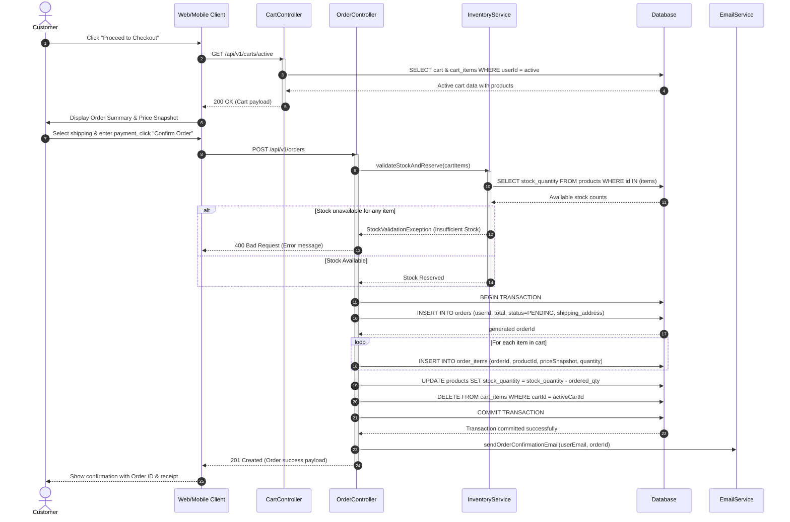
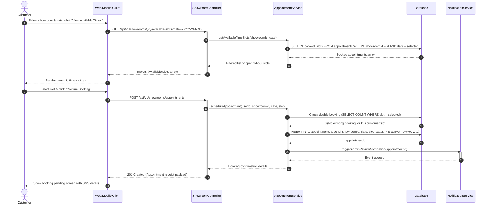
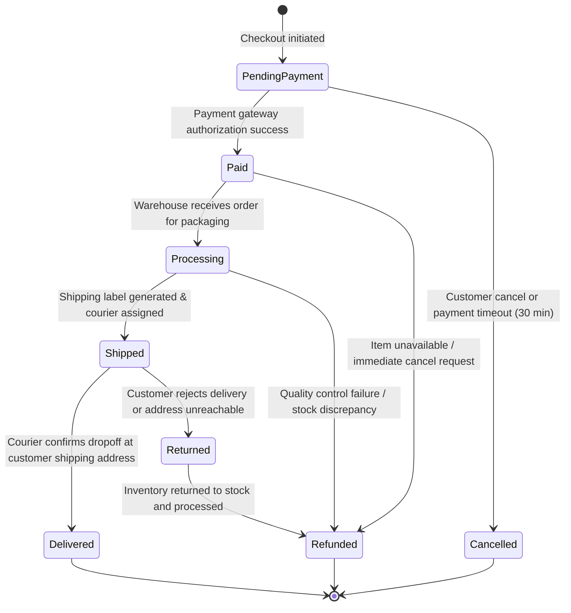
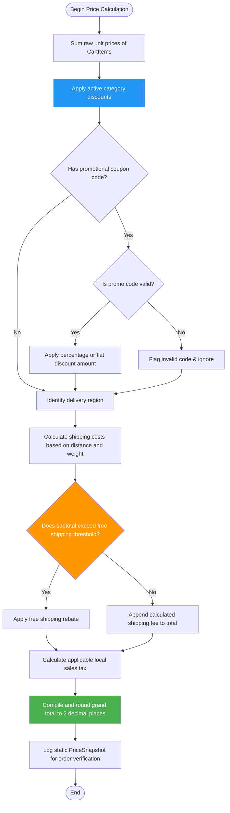

# 07. UML Behavioral Models

## 7.1 Sequence Diagram: Checkout & Place Order

This diagram illustrates the step-by-step API interactions and database transactions when a customer completes a purchase (UC-004).



## 7.2 Sequence Diagram: Book Showroom Visit

This diagram tracks the interactions when a customer schedules an appointment to view premium furniture in the physical showroom (UC-007).


## 7.3 Activity Diagram: Order Processing & Checkout

This flow chart details the complete procedural path of the checkout process, covering inventory verification, rollback scenarios, and error handling.

```mermaid
flowchart TD
    Start([Start Checkout]) --> A[Retrieve active cart items]

    A --> B{Is cart empty?}

    B -->|Yes| C[Display "Empty Cart" warning]
    C --> End1([End])

    B -->|No| D{Are all items in stock?}

    D -->|No| E[Highlight out-of-stock items]
    E --> F[Prompt user to update quantities or remove items]
    F --> A

    D -->|Yes| G[Lock stock quantities temporarily]
    G --> H[Render order summary with Price Snapshot]

    H --> I{User completes payment?}

    I -->|No / Cancelled| J[Release locked stock back to inventory]
    J --> End2([End])

    I -->|Yes| K[Create Order & OrderItem records]
    K --> L[Update physical database stock count]
    L --> M[Clear user active shopping cart]
    M --> N[Send receipt and tracking details to customer]
    N --> End3([End])

    style B fill:#ff9800,color:#fff
    style D fill:#ff9800,color:#fff
    style I fill:#ff9800,color:#fff
    style K fill:#4caf50,color:#fff
```

---

## 7.4 State Machine Diagram: Order Lifecycle

This state machine tracks the dynamic transitions of an order's status from initial cart checkout up to successful shipping, delivery, or cancellation.



### State Descriptions & Rules

| State | Description | Allowed Transitions |
|-------|-------------|---------------------|
| **PendingPayment** | Order is registered but payment verification is pending. Stock is temporarily locked. | Paid, Cancelled |
| **Paid** | Payment confirmed by gateway. Order is queued for warehouse processing. | Processing, Refunded |
| **Processing** | Warehouse operators are picking, packing, and preparing the package. | Shipped, Refunded |
| **Shipped** | Package has been handed over to the courier partner; tracking ID is active. | Delivered, Returned |
| **Delivered** | Customer has signed for the delivery. Terminal successful state. | None |
| **Returned / Cancelled** | Orders that failed to deliver or were abandoned. Stock is returned to active catalog. | Refunded (if paid) |

## 7.5 Activity Diagram: Dynamic Price & Discount Calculation

This diagram models the business logic engine for compiling cart subtotals, applying categorical/coupon discounts, calculating region-based shipping, and generating the final billing total.



### Scenario Calculation Example

| Step | Item | Rule Type | Calculation Process | Resulting Subtotal |
|------|------|-----------|---------------------|-------------------:|
| 1 | Raw Cart Total | 3 Premium Items | $400.00 + $250.00 + $150.00 | **$800.00** |
| 2 | Active Promo Code | SUMMER15 (15%) | Subtract 15% of cart subtotal | **$680.00** |
| 3 | Shipping Assessment | Standard Delivery | Distance exceeds zone limit (+$45.00) | **$725.00** |
| 4 | Free Shipping Rule | Threshold Check | Since subtotal ($680.00) > $500.00, shipping rebate applied | **-$45.00** |
| 5 | Sales Tax | Regional Rate (8.25%) | Apply tax to taxable subtotal | **+$56.10** |
| 6 | Final Price Snapshot | Order Grand Total | Rounded final billing amount | **$736.10** |

---

**← Previous:** Domain Model  
**Back to Index**  
**Next:** Database Design →
