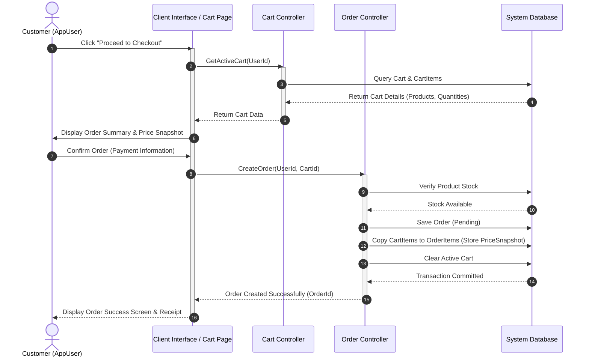
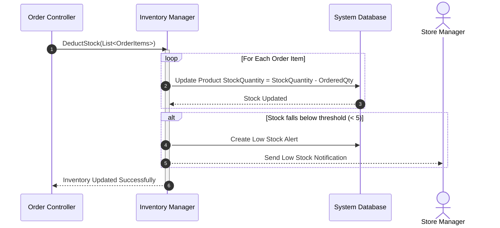

# 07. UML Behavioral Diagrams

## 📌 Overview

This document outlines the dynamic behavior and interactions within the **Ruqi Store** system. While the Domain Model defines the static structure, these behavioral diagrams illustrate how system components collaborate over time to support two key business use cases:

- **User Checkout & Order Placement**
- **Inventory Synchronization After Purchase**

---

## 🔄 1. Checkout & Order Placement (Sequence Diagram)

This Sequence Diagram illustrates the interactions between the customer, the user interface, the shopping cart, and the order controller during the checkout process.

---

## 📦 2. Inventory Adjustment System (Sequence Diagram)

This workflow illustrates how inventory is automatically updated after an order is successfully placed, preventing overselling.

---

## 📑 3. Behavioral Rules & Constraints

To ensure data integrity and provide a seamless checkout experience, the system enforces the following rules:

- **Price Snapshot:** During checkout, each `OrderItem` stores a fixed `PriceSnapshot`. Future changes to the associated `Product` price do not affect historical orders.

- **Atomic Transaction:** Stock validation, order creation, inventory deduction, and cart clearance are executed within a single database transaction to prevent race conditions and overselling.

- **Automatic Cart Clearance:** After a successful order, all `CartItem` records associated with the user's active cart are automatically removed.

- **Low Stock Monitoring:** When a product's stock falls below the predefined threshold, the system automatically generates a low-stock alert for the administrator.
