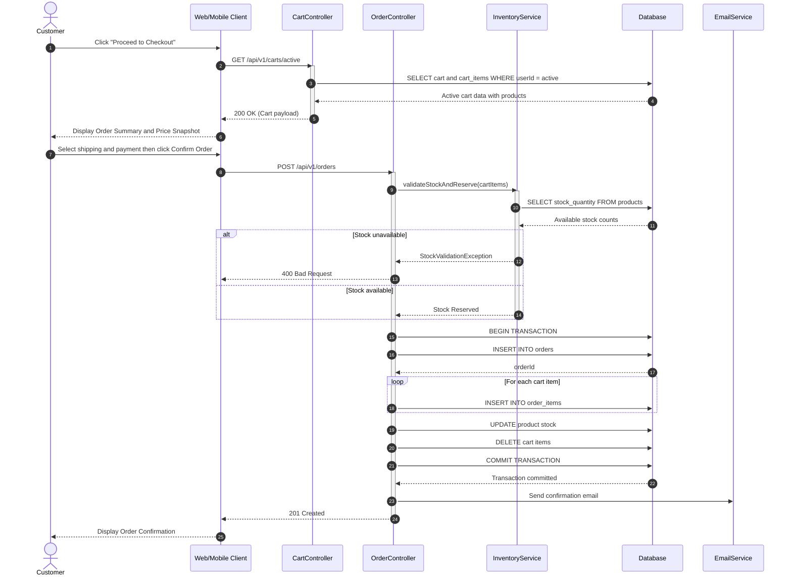
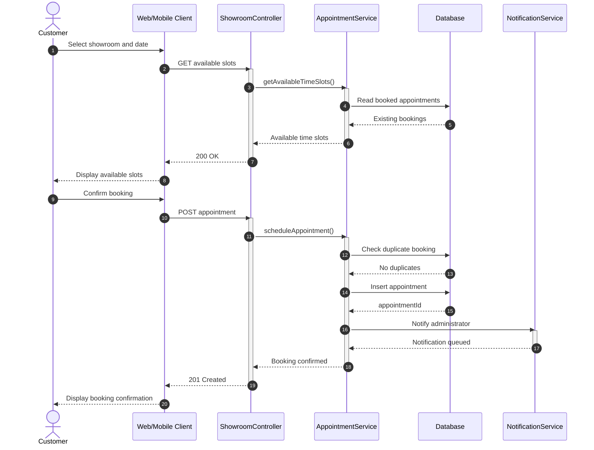
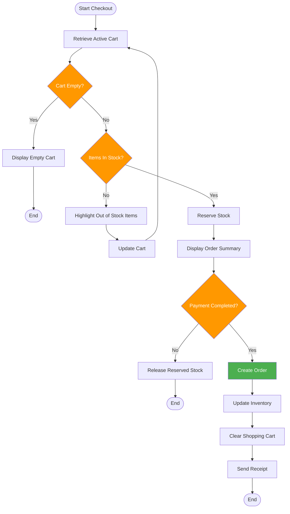
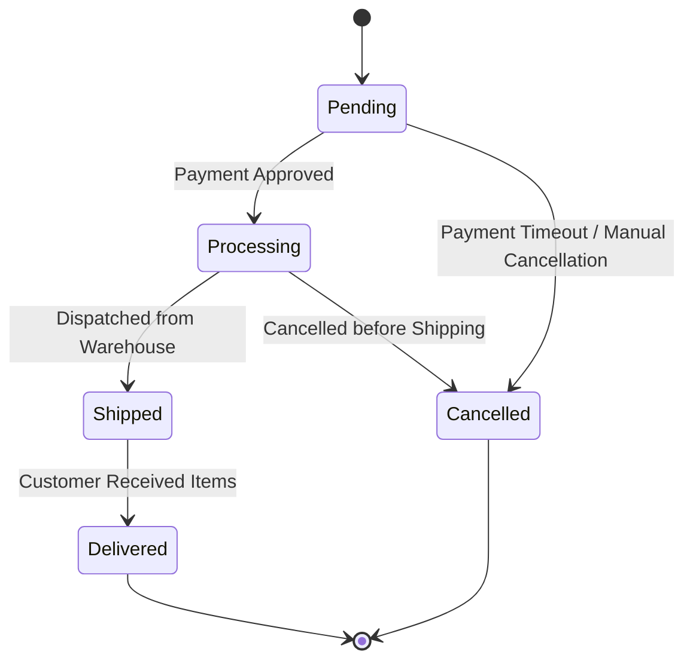
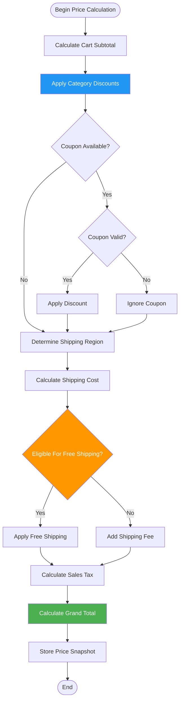

# 07. UML Behavioral Models

## 7.1 Sequence Diagram: Checkout & Place Order

This diagram illustrates the step-by-step API interactions and database transactions when a customer completes a purchase (UC-004).

---

## 7.2 Sequence Diagram: Book Showroom Visit

This diagram tracks the interactions when a customer schedules a showroom appointment (UC-007).

## 7.3 Activity Diagram: Order Processing & Checkout

This flowchart details the checkout process.

---
## 7.4 State Machine Diagram: Order Lifecycle

### State Descriptions & Rules

| State | Description | Allowed Transitions |
| :--- | :--- | :--- |
| **Pending** | Order is created, payment review is pending, and stock is reserved. | Processing, Cancelled |
| **Processing** | Payment is verified, and the warehouse manager is preparing the furniture order. | Shipped, Cancelled |
| **Shipped** | Order has been handed over to the delivery team. | Delivered |
| **Delivered** | Final successful state. The furniture is delivered to the customer. | None |
| **Cancelled** | The order is terminated, and any reserved stock is immediately released. | None |

---

## 7.5 Activity Diagram: Dynamic Price & Discount Calculation

### Scenario Calculation Example

| Step | Item | Rule Type | Calculation Process | Resulting Subtotal |
|------|------|-----------|---------------------|-------------------:|
| 1 | Raw Cart Total | 3 Premium Items | $400.00 + $250.00 + $150.00 | **$800.00** |
| 2 | Promo Code | SUMMER15 (15%) | Apply 15% discount | **$680.00** |
| 3 | Shipping | Standard Delivery | Shipping fee +$45.00 | **$725.00** |
| 4 | Free Shipping | Threshold Rule | Shipping rebate -$45.00 | **-$45.00** |
| 5 | Sales Tax | 8.25% | Tax +$56.10 | **+$56.10** |
| 6 | Final Total | Price Snapshot | Rounded total | **$736.10** |

---

[← Previous: Domain Model](./06-domain-model.md) | [Back to Index](./00-index.md) | [Next: Database Design →](./08-database-design.md)
