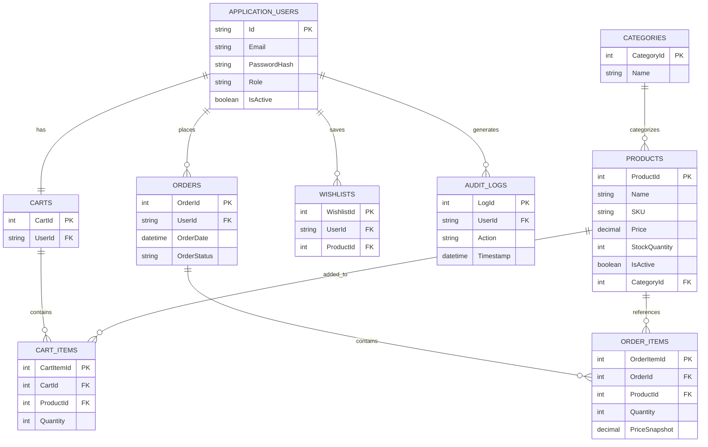

# 04. Database Design

## 📌 Overview

This document describes the relational database schema for the **Ruqi Store** system. It defines the database tables, primary keys, foreign keys, important columns, physical data types, and the relationships that ensure data integrity and efficient system performance.

---

## 📊 Entity Relationship Diagram (ERD)

The following diagram illustrates the relationships between the database tables using foreign key constraints.

---

## 🔑 Database Tables & Schema Details

| Table | Primary Key | Foreign Keys | Important Columns & Types | Description |
|-------|-------------|--------------|---------------------------|-------------|
| **ApplicationUsers** | Id (NVARCHAR) | None | Email (NVARCHAR), PasswordHash (NVARCHAR), Role (NVARCHAR), IsActive (BIT) | Inherits from ASP.NET Core Identity and manages user credentials and roles. |
| **Categories** | CategoryId (INT) | None | Name (NVARCHAR) | Stores product categories such as Office or Living Room. |
| **Products** | ProductId (INT) | CategoryId | Name (NVARCHAR), SKU (NVARCHAR), Price (DECIMAL), StockQuantity (INT), IsActive (BIT) | Stores inventory items and their availability. |
| **Carts** | CartId (INT) | UserId | — | Maintains one active shopping cart per user. |
| **CartItems** | CartItemId (INT) | CartId, ProductId | Quantity (INT) | Represents the products currently added to a shopping cart. |
| **Wishlists** | WishlistId (INT) | UserId, ProductId | — | Stores products saved by users for future purchases. |
| **Orders** | OrderId (INT) | UserId | OrderDate (DATETIME), OrderStatus (NVARCHAR) | Stores completed customer orders. |
| **OrderItems** | OrderItemId (INT) | OrderId, ProductId | Quantity (INT), PriceSnapshot (DECIMAL) | Stores purchased products and preserves their purchase prices. |
| **AuditLogs** | LogId (INT) | UserId | Action (NVARCHAR), Timestamp (DATETIME) | Records important user and administrator actions. |

---

## 🔗 Enforced Key Relationships

### User → Cart (One-to-One)

Each user can have only one active shopping cart. A unique constraint on the `UserId` column in the `Carts` table enforces this relationship.

### Category → Products (One-to-Many)

Each category can contain multiple products. Categories containing existing products cannot be deleted (`ON DELETE RESTRICT`) to preserve referential integrity.

### Order → OrderItems (One-to-Many)

Each order consists of one or more order items. Deleting an order cascades to its associated order items (`ON DELETE CASCADE`).

### Product → OrderItems (Price Snapshot)

When an order is placed, the current product price is copied into `OrderItem.PriceSnapshot`. This ensures that historical order records remain unchanged even if product prices are updated later.
