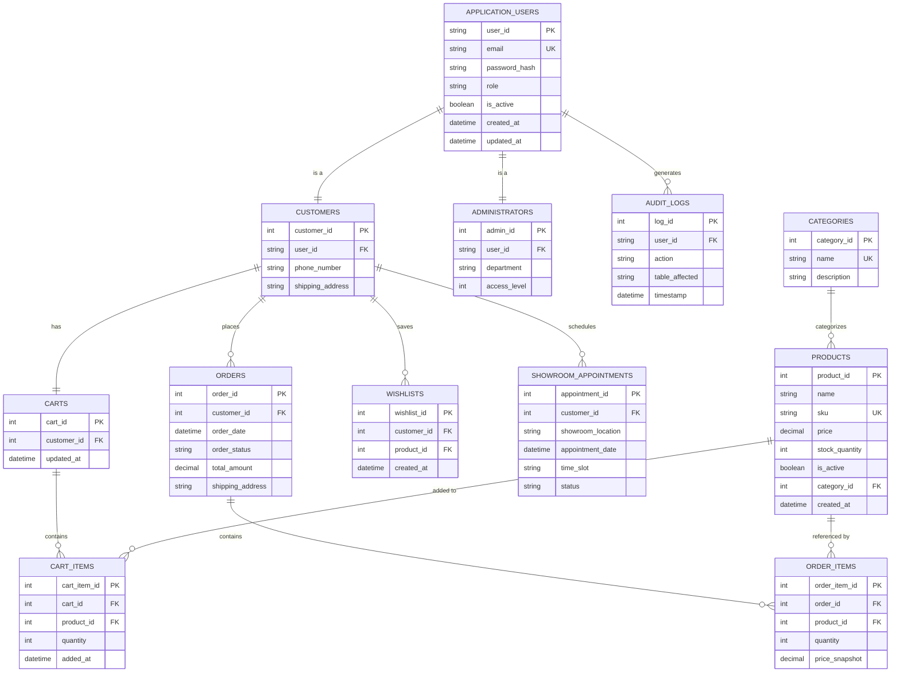

# 08. Database Design

## 8.1 Entity-Relationship Diagram (ERD)

This diagram defines the relational database model for **Ruqi Store**, representing user accounts, dynamic shopping carts, catalog items, order processing state tracking, and secure action logs.


## 8.2 Normalized Schema (3NF)

The dynamic relational schema of **Ruqi Store** is strictly normalized to **Third Normal Form (3NF)** to eliminate data redundancy, prevent modification anomalies, and enforce absolute referential integrity.

---

## Core Identity & Role Tables

### application_users

| Column | Type | Constraints | Notes |
| :--- | :--- | :--- | :--- |
| user_id | VARCHAR(450) | PK | Generated GUID for secure identity tracking |
| email | VARCHAR(256) | NOT NULL, UNIQUE | Primary login credential, normalized to lowercase |
| password_hash | VARCHAR(MAX) | NOT NULL | Password hash generated using PBKDF2/BCrypt |
| role | ENUM('CUSTOMER', 'ADMIN') | NOT NULL | System authorization level |
| is_active | BOOLEAN | NOT NULL, DEFAULT TRUE | Soft-deletion flag for system auditing |
| created_at | DATETIME2 | NOT NULL, DEFAULT GETDATE() | Automatic timestamp |
| updated_at | DATETIME2 | NOT NULL, DEFAULT GETDATE() | Dynamic on-update timestamp |

### customers

| Column | Type | Constraints | Notes |
| :--- | :--- | :--- | :--- |
| customer_id | INT | PK, AUTO_INCREMENT | Unique identifier for buyer profile |
| user_id | VARCHAR(450) | FK → application_users, UNIQUE | 1:1 relationship with base user record |
| phone_number | VARCHAR(20) | NULL | Optional customer contact phone |
| shipping_address | NVARCHAR(500) | NULL | Default physical address for shipping |

### administrators

| Column | Type | Constraints | Notes |
| :--- | :--- | :--- | :--- |
| admin_id | INT | PK, AUTO_INCREMENT | Unique identifier for staff profile |
| user_id | VARCHAR(450) | FK → application_users, UNIQUE | 1:1 relationship with base user record |
| department | VARCHAR(100) | NOT NULL | Internal division (e.g., Inventory, Support) |
| access_level | INT | NOT NULL, DEFAULT 1 | Granular permission index (1 = basic, 5 = super) |

---

## Catalog & Inventory Tables

### categories

| Column | Type | Constraints | Notes |
| :--- | :--- | :--- | :--- |
| category_id | INT | PK, AUTO_INCREMENT | Unique catalog branch index |
| name | VARCHAR(100) | NOT NULL, UNIQUE | Category name (e.g., "Office", "Living Room") |
| description | NVARCHAR(500) | NULL | Category context and metadata |

### products

| Column | Type | Constraints | Notes |
| :--- | :--- | :--- | :--- |
| product_id | INT | PK, AUTO_INCREMENT | Unique product inventory SKU-holder |
| name | NVARCHAR(200) | NOT NULL | Public product title |
| sku | VARCHAR(50) | NOT NULL, UNIQUE | Stock Keeping Unit code for inventory scan |
| price | DECIMAL(18,2) | NOT NULL, CHECK (price >= 0.00) | Current list selling price |
| stock_quantity | INT | NOT NULL, CHECK (stock_quantity >= 0) | Real-time physical warehouse count |
| is_active | BOOLEAN | NOT NULL, DEFAULT TRUE | Soft-delete to hide inactive products |
| category_id | INT | FK → categories | References parent catalog category |
| created_at | DATETIME2 | NOT NULL, DEFAULT GETDATE() | Date product entered the system |
---

## Carts & Wishlists (Session Data)

### carts

| Column | Type | Constraints | Notes |
| :--- | :--- | :--- | :--- |
| cart_id | INT | PK, AUTO_INCREMENT | Dynamic user session cart identifier |
| customer_id | INT | FK → customers, UNIQUE | Guarantees exactly one active cart per customer |
| updated_at | DATETIME2 | NOT NULL, DEFAULT GETDATE() | Tracks cart activity for abandonment timeout |

### cart_items

| Column | Type | Constraints | Notes |
| :--- | :--- | :--- | :--- |
| cart_item_id | INT | PK, AUTO_INCREMENT | Identifies line items in user carts |
| cart_id | INT | FK → carts, ON DELETE CASCADE | Bound to the customer's active cart |
| product_id | INT | FK → products, ON DELETE CASCADE | References the selected product |
| quantity | INT | NOT NULL, CHECK (quantity > 0) | Number of units requested |
| added_at | DATETIME2 | NOT NULL, DEFAULT GETDATE() | Timestamp when the item was added |

**Unique Constraint**

```text
UNIQUE(cart_id, product_id)
```

This constraint prevents duplicate entries for the same product in a single cart by updating the quantity instead.

### wishlists

| Column | Type | Constraints | Notes |
| :--- | :--- | :--- | :--- |
| wishlist_id | INT | PK, AUTO_INCREMENT | Unique wishlist record |
| customer_id | INT | FK → customers, ON DELETE CASCADE | Associated customer profile |
| product_id | INT | FK → products, ON DELETE CASCADE | Saved product |
| created_at | DATETIME2 | NOT NULL, DEFAULT GETDATE() | Date the product was added |

**Unique Constraint**

```text
UNIQUE(customer_id, product_id)
```

This constraint prevents the same customer from saving the same product more than once.

### showroom_appointments

| Column | Type | Constraints | Notes |
| :--- | :--- | :--- | :--- |
| appointment_id | INT | PK, AUTO_INCREMENT | Unique appointment identifier |
| customer_id | INT | FK → customers, ON DELETE CASCADE | The customer booking the visit |
| showroom_location | VARCHAR(200) | NOT NULL | Target physical showroom branch |
| appointment_date | DATE | NOT NULL | Scheduled calendar date |
| time_slot | VARCHAR(50) | NOT NULL | Hourly slot (e.g., "10:00 AM - 11:00 AM") |
| status | VARCHAR(50) | NOT NULL, DEFAULT 'PENDING_APPROVAL' | State tracking pipeline |

---

## Checkout & Ordering Tables

### orders

| Column | Type | Constraints | Notes |
| :--- | :--- | :--- | :--- |
| order_id | INT | PK, AUTO_INCREMENT | Globally unique order identifier |
| customer_id | INT | FK → customers | Owner of the finalized order |
| order_date | DATETIME2 | NOT NULL, DEFAULT GETDATE() | Immutable transaction timestamp |
| order_status | VARCHAR(50) | NOT NULL, DEFAULT 'PENDING' | Current order status |
| total_amount | DECIMAL(18,2) | NOT NULL | Final order value after discounts and taxes |
| shipping_address | NVARCHAR(500) | NOT NULL | Locked delivery address |

### order_items

| Column | Type | Constraints | Notes |
| :--- | :--- | :--- | :--- |
| order_item_id | INT | PK, AUTO_INCREMENT | Unique order line |
| order_id | INT | FK → orders, ON DELETE CASCADE | Parent order |
| product_id | INT | FK → products, ON DELETE RESTRICT | Prevents deletion of purchased products |
| quantity | INT | NOT NULL, CHECK (quantity > 0) | Purchased quantity |
| price_snapshot | DECIMAL(18,2) | NOT NULL | Product price at the moment of purchase |

---

## System Logging

### audit_logs

| Column | Type | Constraints | Notes |
| :--- | :--- | :--- | :--- |
| log_id | INT | PK, AUTO_INCREMENT | Automated system tracking identifier |
| user_id | VARCHAR(450) | FK → application_users | User who performed the action |
| action | VARCHAR(250) | NOT NULL | Operation name (e.g., `UPDATE_PRICE`) |
| table_affected | VARCHAR(100) | NOT NULL | Target database table (e.g., `products`) |
| timestamp | DATETIME2 | NOT NULL, DEFAULT GETDATE() | Precise timestamp for auditing and compliance |

---

# 8.3 Key Design Decisions

## Inheritance Strategy (User → Customer / Administrator)

The system adopts a **Joined Table Inheritance** strategy.

The `application_users` table stores identity information shared by every user, including authentication credentials, role assignment, account status, and timestamps. Role-specific information is stored in the `customers` and `administrators` tables, each maintaining a strict **1:1** relationship with the base user record through the `user_id` foreign key.

This approach avoids sparse tables containing numerous `NULL` values while improving maintainability and enforcing clear separation of responsibilities.

---

## Dynamic Shopping Carts & Uniqueness

Each customer is allowed **exactly one active shopping cart**.

This rule is enforced through a **UNIQUE** constraint on the `customer_id` column in the `carts` table.

Products placed in the cart are stored in the `cart_items` table. A composite unique constraint:

```text
UNIQUE(cart_id, product_id)
```

ensures that adding the same product multiple times simply increases its quantity instead of creating duplicate rows.

---

## The Price Snapshot Pattern

To preserve historical accuracy, the `order_items` table stores a `price_snapshot` value.

During checkout, the system copies the product's current selling price into this field. Any future price changes made by administrators affect only new purchases, while completed orders retain their original prices for reporting, accounting, and legal compliance.

---

## Cascade and Deletion Rules

### Order Isolation

Deleting an order automatically removes its associated order items using:

```text
ON DELETE CASCADE
```

This prevents orphaned records from remaining in the database.

### Catalog Safeguard

Products that already appear in completed orders cannot be physically deleted.

The relationship:

```text
ON DELETE RESTRICT
```

on `order_items.product_id` preserves referential integrity and protects historical transaction records.

Instead of deleting products, the application performs **Soft Deletion** by setting:

```text
products.is_active = FALSE
```

This removes products from customer searches while preserving historical order data.

### Cart Cleanup

When a customer account is removed, all associated shopping carts and cart items are automatically deleted using cascading foreign keys.

This keeps the database clean and prevents orphaned session records.

---

[← Previous: UML Behavioral Models](./07-uml-behavioral.md) | [Back to Index](./00-index.md) | [Next: Architectural Design →](./09-architecture.md)
