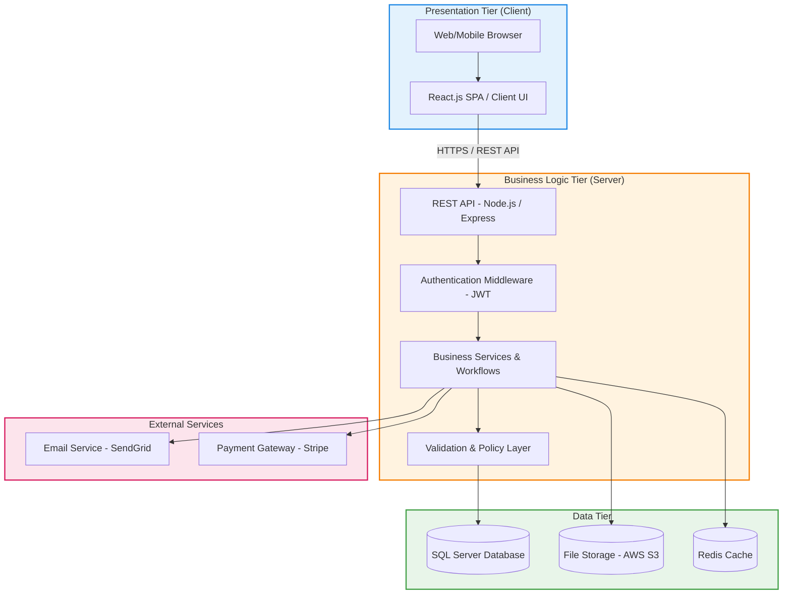
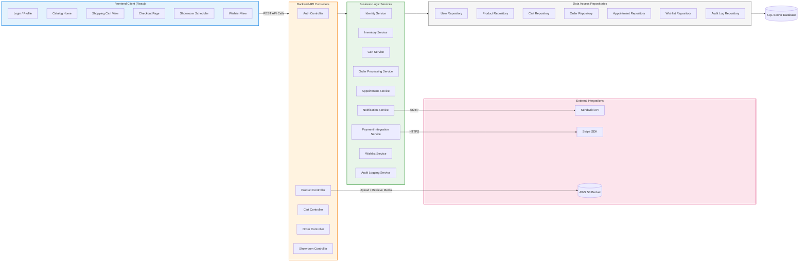
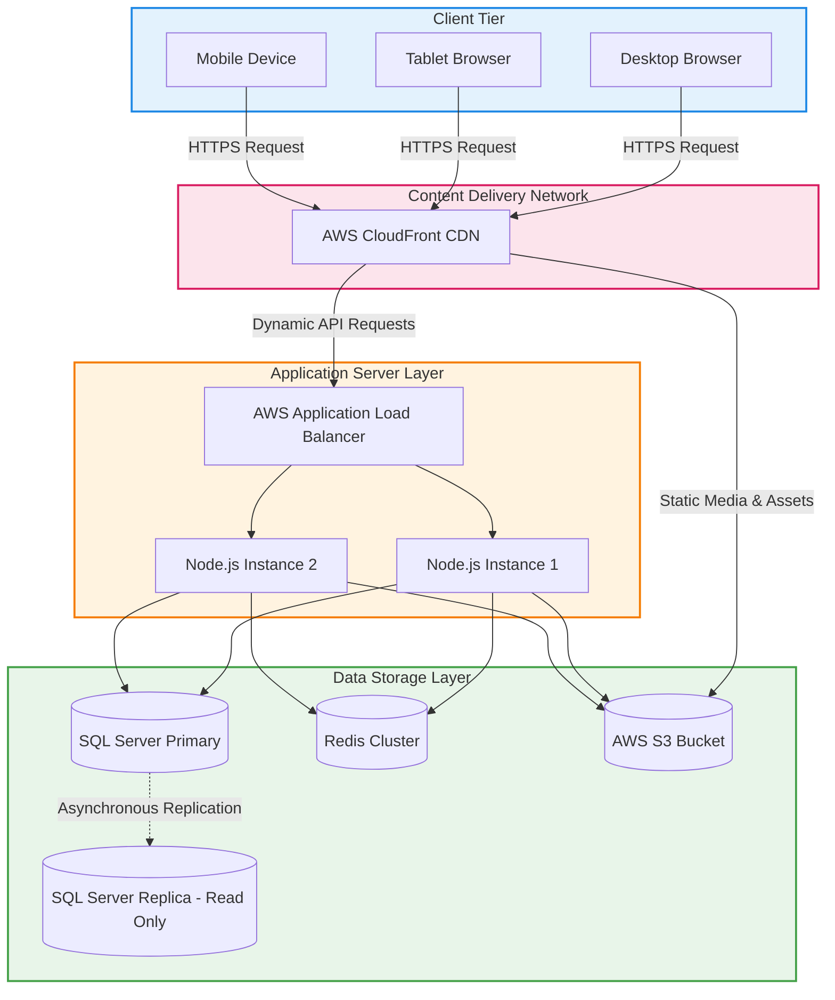

# 09. Architectural Design

## 9.1 Architecture Pattern: Three-Tier

Ruqi Store uses a **three-tier (layered) architecture**, separating the system into Presentation, Business Logic, and Data tiers. This pattern guarantees clean separation of concerns, allows independent scaling of individual tiers, and matches the requirements of a high-performance e-commerce catalog and transaction system.

## 9.2 Technology Stack

| Layer | Technology | Justification |
| :--- | :--- | :--- |
| Frontend | React.js | Component-based structure, fast virtual DOM rendering, and a robust ecosystem for dynamic shopping carts. |
| Backend | Node.js + Express | Event-driven, asynchronous I/O that handles concurrent customer browsing and checkout operations efficiently. |
| Database | SQL Server (MSSQL) | Strict relational model, robust transaction handling (ACID) for order payments, and deep referential integrity. |
| Cache | Redis | Temporary session storage, caching frequently accessed catalog products, and maintaining current cart states. |
| File Storage | AWS S3 | Highly scalable and secure storage for product images, marketing assets, and invoice PDFs. |
| Authentication | JWT + bcrypt | Stateless secure authorization for active sessions and industry-standard salted password hashing. |
| API Style | RESTful | Clean resource-oriented HTTP routing, easy integration, and well-supported testing suites. |
| External Integrations | SendGrid & Stripe | Reliable transactional email notifications and secure, PCI-compliant payment card processing. |
## 9.3 Component Diagram

This diagram displays the structural components of Ruqi Store and how requests propagate from public UI components down to database repositories.

## 9.4 Architectural Decisions

| Decision Topic | Selected Approach | Alternatives Considered | Rationale |
| :--- | :--- | :--- | :--- |
| Architecture Pattern | Three-Tier Monolith | Microservices | Monolith offers rapid deployment and low operational overhead for a mid-sized e-commerce store, avoiding network latency and complex transaction routing. |
| Frontend Rendering | Single Page App (SPA) | Server-Side Rendering (SSR) | SPA provides seamless state transitions, which is ideal for shopping carts and showroom calendars, while isolating UI processing from the server. |
| Database System | Relational Database (SQL Server) | NoSQL (MongoDB) | E-commerce checkout requires absolute transaction safety (ACID) to update stock levels and record payments securely without collisions. |
| Authentication Style | Stateless JWT Tokens | Session Cookies | JWT tokens support horizontal backend scaling without sticky-session overhead and integrate easily with future native mobile applications. |
| File Hosting | External Storage (AWS S3) | Local Disk Storage | Offloads heavy asset delivery, including high-resolution product and showroom media, from the application server, reducing disk load and improving response times. |

## 9.5 Deployment View

This physical blueprint displays the production network topology of the Ruqi Store system.

Our system architecture is designed to handle up to 1,000 concurrent shopping sessions with ease. The stateless application layer allows developers to add more virtual server instances (App Instance 3, 4, etc.) behind the Application Load Balancer to scale capacity horizontally whenever seasonal traffic peaks.

---

[← Previous: Database Design](./08-database-design.md) | [Back to Index](./00-index.md) | [Next: Detailed Design →](./10-detailed-design.md)
