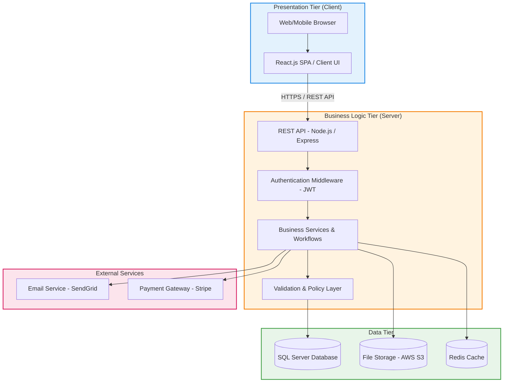

# 09. Architectural Design

## 9.1 Architecture Pattern: Three-Tier

Ruqi Store uses a **three-tier (layered) architecture**, separating the system into Presentation, Business Logic, and Data tiers. This pattern guarantees clean separation of concerns, allows independent scaling of individual tiers, and matches the requirements of a high-performance e-commerce catalog and transaction system.

## 9.2 Technology Stack

| Layer | Technology | Justification |
| :--- | :--- | :--- |
| Frontend | React.js | Component-based structure, fast virtual DOM rendering, and a robust ecosystem for dynamic shopping carts. |
| Backend | Node.js + Express | Event-driven, asynchronous I/O that handles concurrent customer browsing and checkout operations efficiently. |
| Database | SQL Server (MSSQL) | Strict relational model, robust transaction handling (ACID) for order payments, and deep referential integrity. |
| Cache | Redis | Temporary session storage, caching frequently accessed catalog products, and maintaining current cart states. |
| File Storage | AWS S3 | Highly scalable and secure storage for product images, marketing assets, and invoice PDFs. |
| Authentication | JWT + bcrypt | Stateless secure authorization for active sessions and industry-standard salted password hashing. |
| API Style | RESTful | Clean resource-oriented HTTP routing, easy integration, and well-supported testing suites. |
| External Integrations | SendGrid & Stripe | Reliable transactional email notifications and secure, PCI-compliant payment card processing. |
