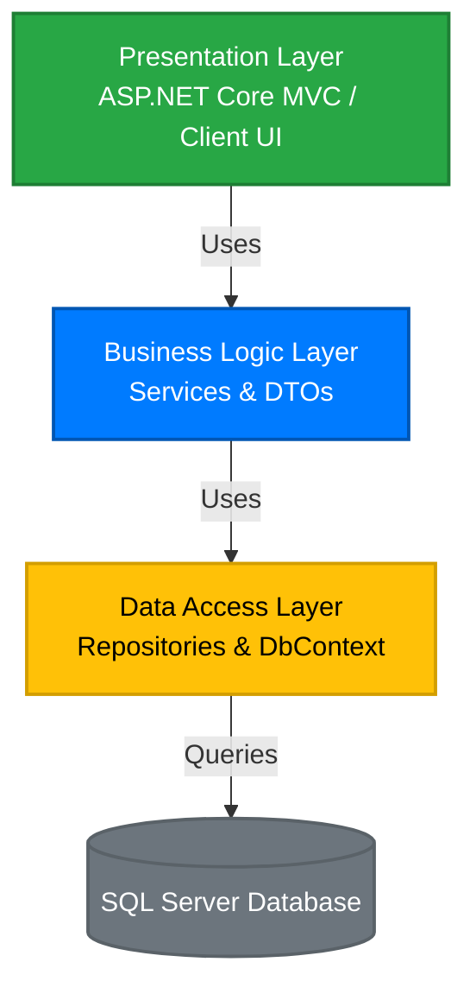
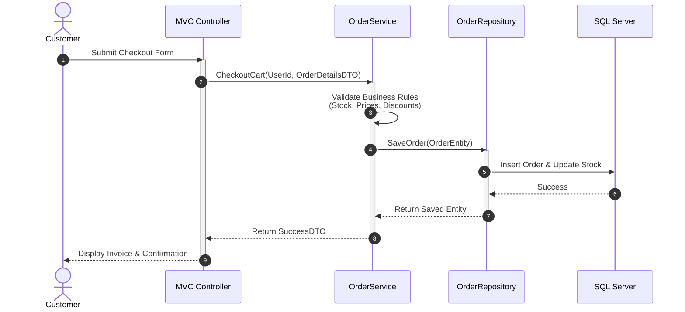

# 09. System Architecture & Design Patterns

## 📌 Overview

This document describes the architectural style, design patterns, and structural blueprint of the **Ruqi Store** e-commerce application. The system follows the **N-Tier (Layered) Architecture** pattern to achieve separation of concerns, maintainability, scalability, and testability.

---

## 🗺️ Architectural Layer Diagram

The following diagram illustrates the application's layered architecture and the unidirectional flow of dependencies from the presentation layer to the database.

---

## 🏛️ Layer Breakdown & Responsibilities

### 1. Presentation Layer (ASP.NET Core MVC / Web API)

**Role**

Acts as the application's entry point. It handles HTTP requests, renders views, validates user input, and returns responses to the client.

**Key Components**

- **Controllers** – Receive requests, invoke business services, and return Views or JSON responses.
- **ViewModels** – Lightweight models used for data binding between the UI and the application.

---

### 2. Business Logic Layer (BLL / Application Services)

**Role**

Contains the core business logic of the Ruqi Store application. It enforces business rules, validates operations, and coordinates application workflows.

**Key Components**

- **Service Interfaces & Implementations** (e.g., `IOrderService`, `ICartService`) – Handle checkout, inventory validation, order processing, and business rules.
- **DTOs (Data Transfer Objects)** – Transfer only the required data between layers while protecting domain entities.

---

### 3. Data Access Layer (DAL / Infrastructure)

**Role**

Communicates directly with SQL Server and performs all Create, Read, Update, and Delete (CRUD) operations.

**Key Components**

- **ApplicationDbContext** – Entity Framework Core database context.
- **Repositories** – Encapsulate data access logic and isolate Entity Framework Core from the Business Logic Layer.

---

## 🔄 Unidirectional Data Flow Example (Checkout Process)

---

## ⚙️ Key Architectural Design Patterns

### Dependency Injection (DI)

Dependency Injection removes hard dependencies by registering services and repositories in `Program.cs`. This improves modularity, maintainability, and unit testing.

### Repository Pattern

The Repository Pattern abstracts database operations behind repository interfaces, allowing the Business Logic Layer to remain independent of Entity Framework Core.

### Unit of Work

The Unit of Work pattern groups multiple database operations into a single transaction, ensuring consistency and preventing partial updates during operations such as checkout.

### DTO Projection

DTOs prevent domain entities from being exposed directly to the Presentation Layer. This improves security, reduces over-posting risks, and minimizes unnecessary data transfer.

### Separation of Concerns (SoC)

Each architectural layer has a single responsibility:

- **Presentation Layer** → User interaction
- **Business Logic Layer** → Business rules and workflows
- **Data Access Layer** → Database operations
- **Database** → Persistent data storage
