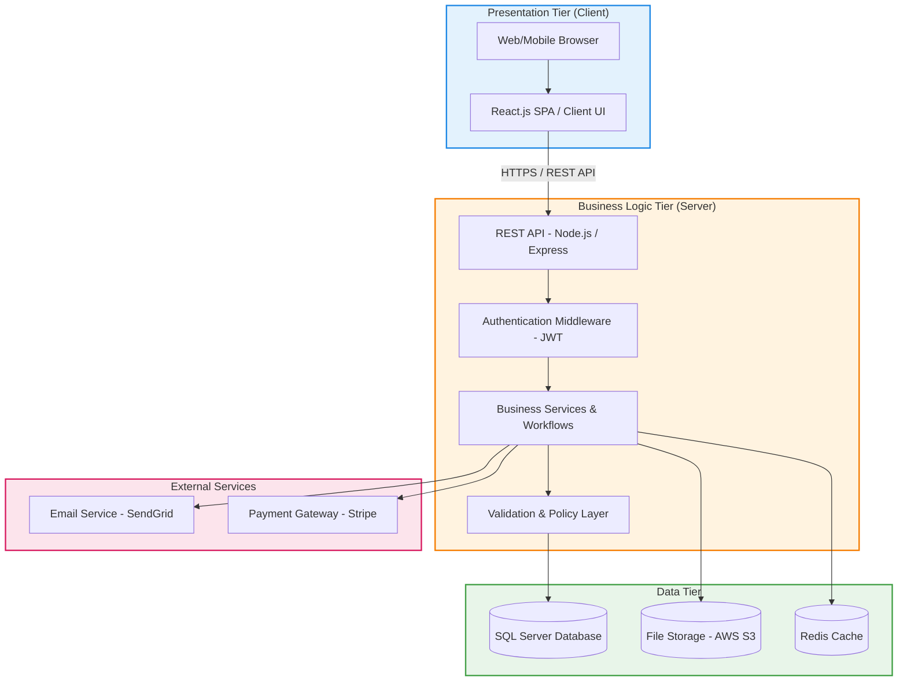
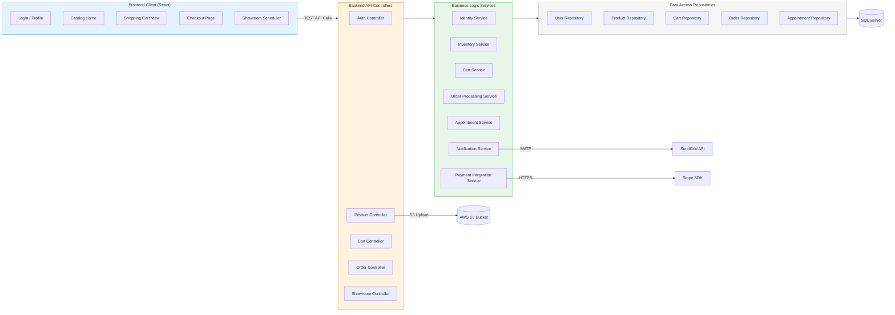
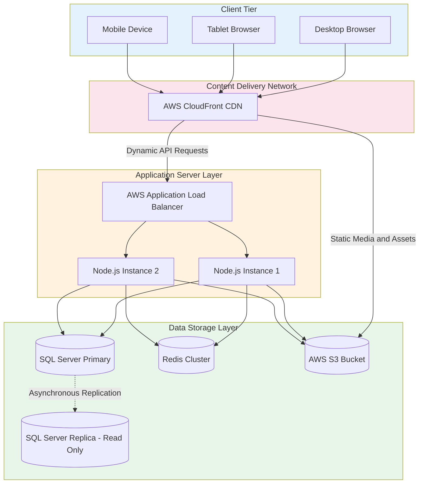

# 09. Architectural Design

## 9.1 Architecture Pattern: Three-Tier

Ruqi Store uses a **three-tier (layered) architecture**, separating the system into Presentation, Business Logic, and Data tiers. This pattern guarantees clean separation of concerns, allows independent scaling of individual tiers, and matches the requirements of a high-performance e-commerce catalog and transaction system.

| Layer | Technology | Justification |
|---|---|---|
| Frontend | React.js | Component-based structure, fast virtual DOM rendering, and a robust ecosystem for dynamic shopping carts. |
| Backend | Node.js + Express | Event-driven asynchronous I/O that efficiently handles concurrent customer browsing and checkout operations. |
| Database | SQL Server (MSSQL) | Strong relational model, ACID transaction support for order payments, and reliable referential integrity. |
| Cache | Redis | Temporary session storage and caching frequently accessed catalog products and active cart states. |
| File Storage | AWS S3 | Highly scalable and secure storage for product images, marketing assets, and invoice PDFs. |
| Authentication | JWT + bcrypt | Stateless secure authorization and industry-standard salted password hashing. |
| API Style | RESTful API | Clean resource-oriented HTTP routing with easy integration and strong testing support. |
| External Integrations | SendGrid & Stripe | Reliable transactional email notifications and secure PCI-compliant payment processing. |

## 9.3 Component Diagram

This diagram displays the structural components of Ruqi Store and how requests propagate from public UI components down to database repositories.

## 9.4 Architectural Decisions

| Decision Topic | Selected Approach | Alternatives Considered | Rationale |
|---|---|---|---|
| Architecture Pattern | Three-Tier | Microservices | A three-tier architecture provides rapid deployment and lower operational overhead for a mid-sized e-commerce store while avoiding network latency and complex transaction routing. |
| Frontend Rendering | Single Page Application (SPA) | Server-Side Rendering (SSR) | SPA provides seamless state transitions, making it ideal for shopping carts, interactive catalogs, and showroom scheduling features while keeping UI processing separate from the server. |
| Database System | Relational Database (SQL Server) | NoSQL (MongoDB) | E-commerce checkout requires strong transaction safety (ACID) to update inventory levels and process payments securely without conflicts. |
| Authentication Style | Stateless JWT Tokens | Session Cookies | JWT tokens support horizontal backend scaling without sticky-session requirements and integrate easily with future mobile applications. |
| File Hosting | External Storage (AWS S3) | Local Disk Storage | External storage reduces application server load by handling large product images, marketing assets, and showroom media efficiently. |

---

## 9.5 Deployment View

This physical blueprint displays the production network topology of the Ruqi Store system.

Our system architecture is designed to handle up to 1,000 concurrent shopping sessions with ease. The stateless application layer allows developers to add more virtual server instances (App Instance 3, 4, etc.) behind the Application Load Balancer to scale capacity horizontally whenever seasonal traffic peaks.

---

[← Previous: Database Design](./08-database-design.md) | [Back to Index](./00-index.md) | [Next: Detailed Design →](./10-detailed-design.md)
