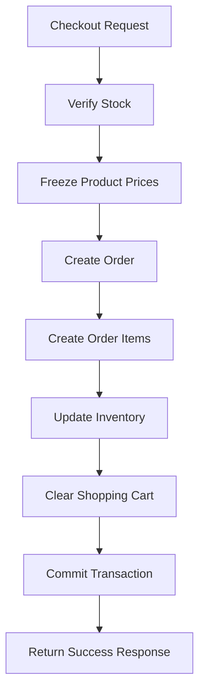

# 10. Detailed Class Design & API Contracts

## 📌 Overview

> **Purpose**
>
> This document defines the service interfaces, Data Transfer Objects (DTOs), API contracts, and validation rules used by the **Ruqi Store** backend. It serves as a technical reference for implementing the Business Logic Layer while promoting maintainability, loose coupling, and scalability.

---

## 📑 Contents

- Service Contracts & Interfaces
- Data Transfer Objects (DTOs)
- System Validation & Business Rules
- Design Principles
- Summary

---

# 🛠️ 1. Service Contracts & Interfaces

The following interfaces define the contracts between the Presentation Layer and the Business Logic Layer. Controllers communicate only with interfaces, allowing implementations to be replaced without affecting higher layers.

---

## A. `IOrderService`

**Responsibility**

Handles the complete order lifecycle, including checkout, order retrieval, and order status management.

### Methods

| Method | Description |
|---------|-------------|
| `PlaceOrderAsync()` | Creates a new order from the user's active shopping cart. |
| `GetOrderByIdAsync()` | Returns detailed information about a specific order. |
| `GetUserOrderHistoryAsync()` | Retrieves all previous orders for a user. |
| `UpdateOrderStatusAsync()` | Updates the status of an order (Admin only). |

```csharp
public interface IOrderService
{
    // Executes the checkout process.
    Task<OrderResponseDto> PlaceOrderAsync(
        string userId,
        CheckoutDto checkoutDetails);

    // Retrieves detailed information for a specific order.
    Task<OrderDetailsDto> GetOrderByIdAsync(
        int orderId,
        string userId);

    // Returns all orders belonging to the specified user.
    Task<IEnumerable<OrderSummaryDto>> GetUserOrderHistoryAsync(
        string userId);

    // Updates the order status.
    Task<bool> UpdateOrderStatusAsync(
        int orderId,
        string status);
}
```

---

## B. `ICartService`

**Responsibility**

Manages the user's active shopping cart and validates inventory before checkout.

### Methods

| Method | Description |
|---------|-------------|
| `GetActiveCartAsync()` | Retrieves the user's current shopping cart. |
| `AddToCartAsync()` | Adds a product to the shopping cart. |
| `UpdateCartItemQuantityAsync()` | Changes the quantity of an existing cart item. |
| `RemoveFromCartAsync()` | Removes an item from the shopping cart. |
| `ClearCartAsync()` | Removes all items after successful checkout. |

```csharp
public interface ICartService
{
    // Retrieves the user's active cart.
    Task<CartDto> GetActiveCartAsync(string userId);

    // Adds a product to the shopping cart.
    Task<bool> AddToCartAsync(
        string userId,
        int productId,
        int quantity);

    // Updates the quantity of an existing cart item.
    Task<bool> UpdateCartItemQuantityAsync(
        string userId,
        int cartItemId,
        int newQuantity);

    // Removes an item from the shopping cart.
    Task<bool> RemoveFromCartAsync(
        string userId,
        int cartItemId);

    // Clears all items from the active cart.
    Task<bool> ClearCartAsync(string userId);
}
```

---

# 📦 2. Data Transfer Objects (DTOs)

DTOs are lightweight classes used to transfer data between application layers without exposing Entity Framework entities directly.

---

## `CheckoutDto`

**Purpose**

Carries checkout information from the Presentation Layer to the Business Logic Layer.

```csharp
public class CheckoutDto
{
    public string ShippingAddress { get; set; }
    public string PaymentMethod { get; set; }
    public string ContactPhoneNumber { get; set; }
}
```

---

## `OrderResponseDto`

**Purpose**

Represents the result returned after attempting to place an order.

```csharp
public class OrderResponseDto
{
    public int OrderId { get; set; }
    public bool IsSuccess { get; set; }
    public string Message { get; set; }
    public DateTime OrderDate { get; set; }
    public decimal TotalAmount { get; set; }
}
```

---

## `CartItemDto`

**Purpose**

Represents a single product displayed in the shopping cart.

```csharp
public class CartItemDto
{
    public int CartItemId { get; set; }
    public int ProductId { get; set; }
    public string ProductName { get; set; }
    public decimal UnitPrice { get; set; }
    public int Quantity { get; set; }

    public decimal SubTotal => UnitPrice * Quantity;
}
```

---

# 🔒 3. System Validation & Business Rules

Before any checkout transaction is committed, the following validation rules are enforced.

## Checkout Validation Pipeline

| Step | Validation |
|------|------------|
| **1** | Verify product stock availability. |
| **2** | Read the current product price. |
| **3** | Store the price in `OrderItem.PriceSnapshot`. |
| **4** | Create the `Order` record. |
| **5** | Create all `OrderItems`. |
| **6** | Deduct inventory quantities. |
| **7** | Clear the user's shopping cart. |
| **8** | Commit the transaction. |

### Checkout Workflow



---

## Validation Rules

### Stock Verification

Before creating an order, the application verifies the available inventory for every product in the shopping cart.

- If the requested quantity exceeds the available stock, the checkout process is cancelled.
- An appropriate validation error (such as `InvalidOperationException`) is returned to the user.

---

### Price Snapshot

During checkout, the current product price is copied into the `OrderItem.PriceSnapshot` field.

This ensures historical order data remains unchanged even if product prices are modified later.

---

### Atomic Transaction

The following operations execute within a single `IDbContextTransaction`:

1. Create the order.
2. Create all order items.
3. Save price snapshots.
4. Deduct inventory.
5. Clear the shopping cart.

If any operation fails, the transaction is rolled back automatically to preserve database consistency.

---

# ⚙️ 4. Design Principles

| Principle | Description |
|-----------|-------------|
| **Dependency Injection** | Services are registered through ASP.NET Core Dependency Injection. |
| **Interface-Based Programming** | Controllers depend on interfaces instead of concrete implementations. |
| **Repository Pattern** | Encapsulates all database operations behind repository interfaces. |
| **DTO Pattern** | Prevents Entity Framework models from being exposed to the Presentation Layer. |
| **Asynchronous Programming** | All service methods return `Task` to improve scalability and responsiveness. |
| **Separation of Concerns** | Each application layer has a single, clearly defined responsibility. |

---

# ✅ Summary

This document specifies the backend contracts used by the **Ruqi Store** application.

It includes:

- Service interfaces for the Business Logic Layer.
- Data Transfer Objects (DTOs).
- Checkout validation rules.
- Transaction requirements.
- Architectural design principles.

Together, these contracts provide a clear blueprint for implementing a scalable, maintainable, and secure backend architecture.
