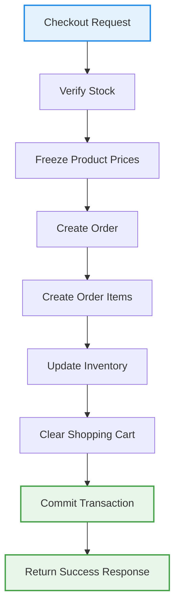

# 10. Detailed Class Design & API Contracts

## 10.1 Design Patterns Applied

The Ruqi Store architecture applies established software design patterns to solve common architectural challenges and maintain a clean separation of concerns.

| Pattern | Category | Where Applied | Problem Solved |
|---|---|---|---|
| **Repository** | Structural | Data Access Layer | Abstracts database operations behind a consistent interface. Isolates business services from raw database queries, allowing caching layers such as Redis to be injected transparently. |
| **MVC** | Architectural | System Presentation & Route Control | Separates UI, business logic, and request orchestration. Controllers process requests, invoke backend services, and return normalized responses or views. |
| **Observer** | Behavioral | Order Notification & Audit Logging | Triggers asynchronous background processes such as sending order confirmation emails, reducing stock, and writing audit logs when an order status changes without tight coupling. |
| **Factory** | Creational | Showroom Appointment Scheduler | A `BookingFactory` creates the correct appointment and notification structure depending on the selected showroom category. |
| **Strategy** | Behavioral | Discount & Promotion System | Different discount calculation strategies can be executed dynamically based on active shopping cart contents. |

---

## 10.2 SOLID Principles in Practice

### Single Responsibility Principle (SRP)

Each service has responsibility for one cohesive part of the business flow.

- `CartService` manages shopping cart operations, item additions, quantity updates, and cart state.
- `InventoryService` manages warehouse stock levels and product availability.
- `PaymentService` processes secure checkout payments.
- `InvoiceService` generates receipt documentation and invoice files.

Each class has only one reason to change.

---

### Open/Closed Principle (OCP)

The promotions and pricing engine supports adding new discount methods without modifying existing checkout logic.

Adding a new discount type only requires creating a new strategy class that implements the shared interface.

```csharp
public interface IDiscountStrategy
{
    decimal ApplyDiscount(
        IEnumerable<CartItemDto> cartItems,
        decimal originalTotal
    );
}

public class PercentageDiscountStrategy : IDiscountStrategy
{
    public decimal ApplyDiscount(
        IEnumerable<CartItemDto> cartItems,
        decimal originalTotal)
    {
        return originalTotal * 0.90m;
    }
}

public class FixedAmountDiscountStrategy : IDiscountStrategy
{
    public decimal ApplyDiscount(
        IEnumerable<CartItemDto> cartItems,
        decimal originalTotal)
    {
        return originalTotal - 50m;
    }
}
```

```csharp
// New strategy can be added without modifying existing checkout logic.

public class FlashSaleDiscountStrategy : IDiscountStrategy
{
    public decimal ApplyDiscount(
        IEnumerable<CartItemDto> cartItems,
        decimal originalTotal)
    {
        return originalTotal * 0.80m;
    }
}
```
## B. ICartService

**Responsibility:**  
Manages the user's active shopping cart and validates inventory before checkout.

```csharp
public interface ICartService
{
    Task<CartDto> GetActiveCartAsync(
        string userId
    );

    Task<bool> AddToCartAsync(
        string userId,
        int productId,
        int quantity
    );

    Task<bool> UpdateCartItemQuantityAsync(
        string userId,
        int cartItemId,
        int newQuantity
    );

    Task<bool> RemoveFromCartAsync(
        string userId,
        int cartItemId
    );

    Task<bool> ClearCartAsync(
        string userId
    );
}
```

---

## C. CartItemDto

**Purpose:**  
Represents a single product displayed in the shopping cart.

```csharp
public class CartItemDto
{
    public int CartItemId { get; set; }

    public int ProductId { get; set; }

    public string ProductName { get; set; }

    public decimal UnitPrice { get; set; }

    public int Quantity { get; set; }

    public decimal SubTotal => UnitPrice * Quantity;
}
```

---
# 10.5 System Validation & Business Rules

Before any checkout transaction is committed, the following validation rules and pipeline operations are strictly enforced.

## Checkout Validation Pipeline

| Step | Validation Action |
|---|---|
| 1 | Verify product stock availability in the warehouse. |
| 2 | Read the live product price from the catalog. |
| 3 | Save and freeze the price inside `OrderItem.PriceSnapshot`. |
| 4 | Generate the base `Order` record. |
| 5 | Generate all associated `OrderItem` records. |
| 6 | Deduct physical inventory stock quantities. |
| 7 | Flush and clear the user's active shopping cart session. |
| 8 | Commit the transaction atomically. |

---

## Checkout Workflow



### Stock Verification

Before creating an order, the application verifies the available inventory for every product in the shopping cart.

If the requested quantity exceeds the available stock, the checkout process is cancelled and a validation error is returned.

---

### Price Snapshot Pattern

During checkout, the current product price is copied into the `OrderItem.PriceSnapshot` field.

This ensures historical transaction and financial data remains accurate even if catalog prices change later.

---

### Atomic Transactions

All checkout operations run within a single shared database transaction.

If any operation fails, the transaction is rolled back automatically to preserve database consistency.

---
