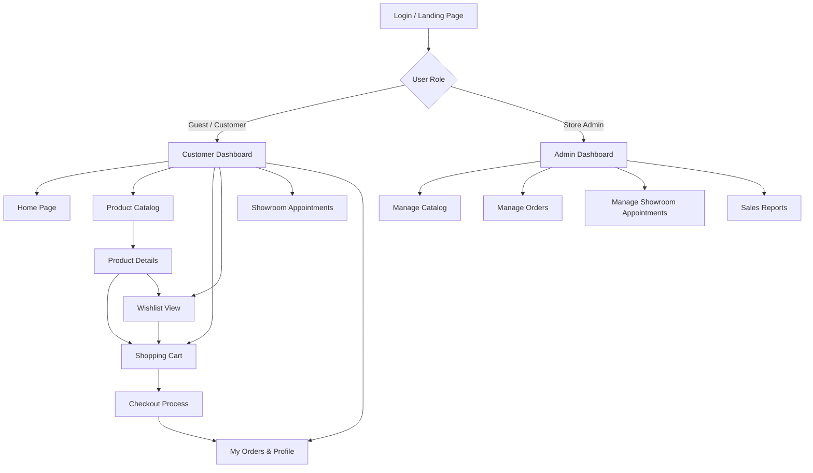

# 11. UI/UX Design & Frontend Specifications
## 11.1 Design Principles

The Ruqi Store interface follows core usability heuristics and premium e-commerce design patterns to ensure a luxurious, accessible, and seamless shopping experience.

| Principle | Application in Ruqi Store |
|-----------|---------------------------|
| **Consistency** | Standardized layout across all views: persistent top navigation with RTL/LTR language toggles, unified product grids, and consistent padding systems. |
| **Visibility of System Status** | Live cart item count badges, active page indicators, explicit tracking of order status (e.g., "Shipped", "Pending"), and highlighted selected time-slots for showroom appointments. |
| **Feedback** | Action validation via non-intrusive top-end toast notifications (e.g., "Added to Cart"), button loading states during payment processing, and dynamic total recalculations. |
| **Error Prevention & Recovery** | Inline form validation for checkout fields, absolute block on choosing past dates for showroom appointments, and clear, friendly guidance if a voucher code is invalid. |
| **Accessibility (WCAG 2.1 AA)** | Text-to-background contrast ratio of at least 4.5:1. Strict keyboard focus indicator visibility, semantic HTML tag distribution, and descriptive `alt` tags for all furniture items. |

---

## 11.2 Navigation Structure


## 11.3 Wireframes

### A. Product Catalog Page (RTL View Example)

```text
┌─────────────────────────────────────────────────────────────┐
│ [Ruqi Logo]   [البحث عن أثاث...]      [العربية/EN]  [🛒 السلة (2)] │
│ الرئيسية | المنتجات | المجموعات | صالة العرض | من نحن      [الحساب] │
├─────────────────────────────────────────────────────────────┤
│ الرئيسية > المنتجات                                         │
│                                                             │
│ تصنيف المنتجات: [ الكل ] [ مقاعد ] [ طاولات ] [ أرائك ] [ إضاءة ] │
├─────────────┬───────────────────────────────────────────────┤
│ تصفية حسب  │ المنتجات المميزة                              │
│             │ ┌──────────────────────┐ ┌──────────────────┐ │
│ السعر       │ │     [صورة المنتج]      │ │  [صورة المنتج]   │ │
│ [=======]   │ │                      │ │                  │ │
│             │ │ كرسي مكتب مريح       │ │ طاولة خشب طبيعي  │ │
│ المواد      │ │ 625.00 ر.س           │ │ 1,250.00 ر.س     │ │
│ [ ] خشب     │ │ [🛒 أضف للسلة] [♡]   │ │ [🛒 أضف للسلة] [♡]│ │
│ [ ] معدن    │ └──────────────────────┘ └──────────────────┘ │
│             │                                               │
│ الألوان     │ ┌──────────────────────┐ ┌──────────────────┐ │
│ [ ] بيج     │ │     [صورة المنتج]      │ │  [صورة المنتج]   │ │
│ [ ] رمادي   │ │ أريكة مخملية فاخرة     │ │ وحدة إضاءة مودرن │ │
│             │ │ 3,400.00 ر.س         │ │ 450.00 ر.س       │ │
│             │ │ [🛒 أضف للسلة] [♡]   │ │ [🛒 أضف للسلة] [♡]│ │
│             │ └──────────────────────┘ └──────────────────┘ │
├─────────────┴───────────────────────────────────────────────┤
│ © 2026 متجر رقي للأثاث الفاخر. جميع الحقوق محفوظة.           │
└─────────────────────────────────────────────────────────────┘
```

### B. Showroom Appointment Page (LTR View Example)
```text
┌─────────────────────────────────────────────────────────────┐
│ [Ruqi Logo] [Search...]              [AR/English] [🛒 Cart] │
│ Home | Products | Collections | Showroom | About Us [Profile] │
├─────────────────────────────────────────────────────────────┤
│ Home > Showroom > Book Appointment                         │
│                                                             │
│ SCHEDULE A SHOWROOM CONSULTATION SESSION                    │
│                                                             │
│ 1. Enter Showroom Location:                                 │
│ [ Main Branch              ]                                │
│                                                             │
│ 2. Select Date & Time Slot:                                 │
│ Date: [2026-07-20]  (Available Days: Mon - Fri)             │
│                                                             │
│ Available Slots:                                            │
│ [10:00 AM] [11:30 AM] [02:00 PM *Selected]                  │
│ [03:30 PM] [05:00 PM] [06:30 PM]                            │
│                                                             │
│ [ Confirm Appointment Booking ]                             │
├─────────────────────────────────────────────────────────────┤
│ © 2026 Ruqi Premium Furniture. All Rights Reserved.         │
└─────────────────────────────────────────────────────────────┘
```
### C. Wishlist Page (RTL View Example)
```text
┌─────────────────────────────────────────────────────────────┐
│ [Ruqi Logo]   [البحث عن أثاث...]      [العربية/EN]  [🛒 السلة (2)] │
│ الرئيسية | المنتجات | المجموعات | صالة العرض | من نحن      [الحساب] │
├─────────────────────────────────────────────────────────────┤
│ الرئيسية > قائمة المفضلة                                    │
│                                                             │
│ قائمة المفضلات الخاصة بي                                    │
├─────────────────────────────────────────────────────────────┤
│ ┌──────────────────────┐ ┌──────────────────┐               │
│ │   [صورة المنتج]      │ │  [صورة المنتج]   │               │
│ │                      │ │                  │               │
│ │ كرسي مكتب مريح       │ │ طاولة خشب طبيعي  │               │
│ │ 625.00 ر.س           │ │ 1,250.00 ر.س     │               │
│ │ [🛒 نقل إلى السلة]   │ │ [🛒 نقل إلى السلة]│               │
│ │ [❌ حذف من المفضلة]  │ │ [❌ حذف من المفضلة]│               │
│ └──────────────────────┘ └──────────────────┘               │
├─────────────────────────────────────────────────────────────┤
│ © 2026 متجر رقي للأثاث الفاخر. جميع الحقوق محفوظة.          │
└─────────────────────────────────────────────────────────────┘
```
## 11.4 Accessibility Considerations

To ensure a highly inclusive and responsive design, the following accessibility mappings are implemented:

| Requirement | Implementation Details |
|------------|------------------------|
| **Color Contrast** | All text fields, tags, and labels strictly maintain a minimum contrast ratio of 4.5:1 against their backgrounds. |
| **Color Independence** | Interface statuses do not rely solely on color codes. Meaningful status indicators (e.g., ✓ Checked, ✗ Out of Stock, ⏰ Reserved) are accompanied by readable helper text. |
| **Keyboard Navigation** | Full interactive control using sequential standard tab focuses (Tab and Shift+Tab). Action fields, dropdown options, and links are responsive to Enter or Spacebar activation. |
| **RTL / LTR Bi-directional Support** | Layout adaptation using logical CSS properties (`margin-inline-start`, `padding-inline-end`). Alignment dynamically mirrors based on the HTML `dir` attribute. |
| **Screen Readers (ARIA)** | Screen elements are marked with descriptive semantics. All visual icons, shopping bags, or user avatars without visible labels are injected with descriptive `aria-label` tags. |
| **Scale & Responsive Layouts** | Base fonts are set to 16px to guarantee clean readability. Elements scale cleanly up to 200% zoom without breaks. Grids adjust dynamically from 1920px desktop to 320px mobile screens. |

---
## 11.5 UI Component Standards

The following design system rules ensure visual excellence and structural consistency throughout the store:

| Component | Specification |
|-----------|---------------|
| **Primary Button** | Deep Navy Blue (`#1A2B4C`), white text, 4px minimal border radius, minimum height of 48px to allow touch-friendly interaction. |
| **Secondary Button** | Transparent background, solid 1px border of `#1A2B4C`, dark navy text. Focus state triggers light gray fills (`#F5F5F5`). |
| **Form Inputs** | Off-white background, 1px border (`#D1D1D1`), 4px border radius, clear dark gray placeholder text, transitioning to `#1A2B4C` border on focus. |
| **Product Cards** | Clean white backgrounds with subtle drop shadows, 0px rounded corners for a modern look, structured typography, and instant visual zoom on image hover. |
| **Toast Notifications** | Displayed in the top-end corner. Auto-dismisses within 4 seconds. Solid green (`#2E7D32`) for success alerts and solid red (`#C62828`) for errors. |
| **Loading Experience** | Integrated Skeleton Screen loaders match the card outlines to maintain layout stability and prevent content shifts (CLS) during API fetching. |

---

[← Previous: Detailed Class Design](./10-detailed-design.md) | [Back to Index](./00-index.md) | [Next: Traceability Matrix](./12-traceability.md)
